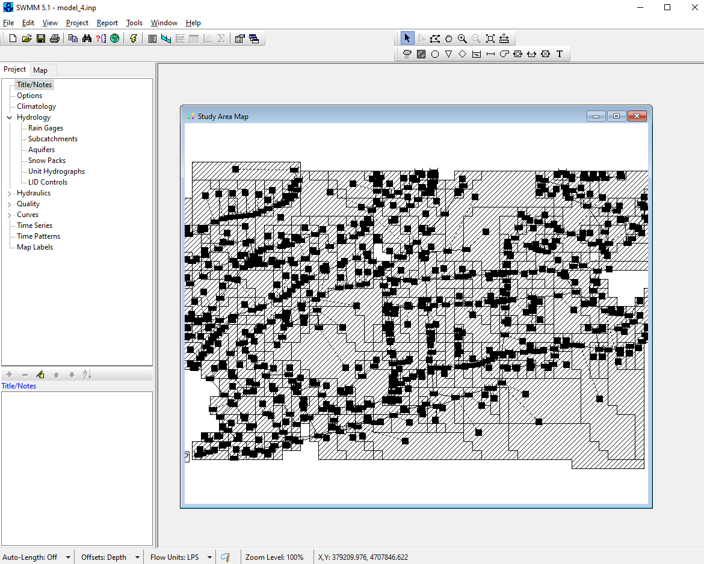

# SWMManywhere: Synthesise Urban Drainage Network Models Anywhere in the World

<!-- markdown-link-check-disable -->
[](https://pypi.python.org/pypi/swmmanywhere/)
[](https://github.com/ImperialCollegeLondon/SWMManywhere/actions/workflows/ci.yml)
[](https://zenodo.org/doi/10.5281/zenodo.13837741)
[](https://codecov.io/gh/ImperialCollegeLondon/SWMManywhere)
<!-- markdown-link-check-enable -->

SWMManywhere is a tool to synthesise urban drainage network models (UDMs) using
publicly available data such as street network, DEM, and building footprints, across
the globe. It also provides tools for generating SWMM input files and performing
simulations for the synthesised UDMs.

## Features

- **Automatic data retrieval and preprocessing**: all of our data requirements
are met with global datasets, so all you need is a bounding box!
- **Customisable network synthesis**: change a range of parameters to create
different networks, power users can easily extend existing functionality.
- **Streamlined evaluation to compare with real networks**: we include a variety
of performance metrics and automatic running/comparing if you have your own SWMM model.
- **Command line interface**: All of this and more can be accessed by passing a
configuration file to a CLI.

## Installation

Install SWMManywhere:

```bash
pip install swmmanywhere
```

Alternatively, it can be installed using `mamba` (`conda` or `micromamba`):

```bash
mamba install -c conda-forge swmmanywhere
```

## Documentation and Quickstart

Once installed, you can simply run SWMManywhere from the command line giving a
configuration file in YAML format as input. As SWMManywhere can download data
automatically from well known sources, this settings file can often be minimal and
restricted to indicating the geographical area to be processed:

`python -m swmmanywhere --config_path=\path\to\config.yml`

The result of the calculation will be a model of the sewage system for that area,
like the following, which can then be further processed or analysed with SWMM, for
example:



<!-- markdown-link-check-disable -->
Follow the [Quickstart](https://imperialcollegelondon.github.io/SWMManywhere/quickstart)
for a more detailed initial example and
[ReadTheDocs](https://imperialcollegelondon.github.io/SWMManywhere/)
for full information of SWMManywhere capabilities.
<!-- markdown-link-check-enable -->

## Use and contributing

This project is licensed under the BSD-3-Clause licence, see [LICENSE](LICENSE).

There are many things we would like to do! If you are interested to contribute
please see [CONTRIBUTING](docs/CONTRIBUTING.md) and [CODE OF CONDUCT](docs/CODE_OF_CONDUCT.md).
