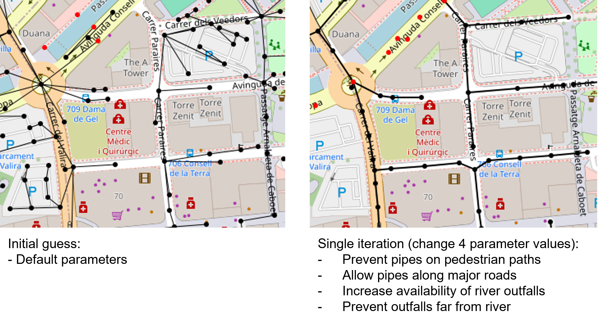

## Summary

Urban drainage network models (UDMs) are useful for a variety of purposes, most notably simulating and alleviating pluvial flooding. Despite the clear usefulness of UDMs, they are often not used owing to the difficulty and expense of creating them. This creates a significant gap for users attempting to generate UDMs if they are not able to perform an expensive underground survey.

## Statement of need

A variety of literature exists to derive UDMs from GIS data, producing hydraulically feasible models that closely approximate real-world systems [@Blumensaat2012-hd;@Chahinian2019-lg;@Reyes-Silva2022-pr;@Chegini2022-oo]. We identify some key limitations of these approaches, most notably the lack of automatic data acquisition and preprocessing, that all approaches are closed-source to date, and that a key feature of such an approach should be to facilitate extension and customisation.

SWMManywhere is an open-source Python package designed for the global synthesis of urban drainage networks. SWMManywhere integrates publicly available geospatial data and automates data acquisition and preprocessing, reducing the technical burden on users. Designed for both researchers and practitioners in urban water management, SWMManywhere responds to the limitations of existing methods by providing an end-to-end, open-source, and customisable solution.

## Features

SWMManywhere includes a variety of key features aimed to improve useability and usefulness. A command line interface (CLI) offers a flexible workflow, providing an accessible entry point to using and customising synthesis. Its parameterized design enables detailed sensitivity analyses, allowing users to understand and manage uncertainties inherent in urban drainage modelling [@Dobson2024-dv]. By emphasizing user control, SWMManywhere allows tuning of outputs with parameters to meet local requirements, making it adaptable to a wide range of scenarios. We provide further details on the data and general approach below.

### Data

A variety of datasets were selected to enable SWMManywhere to be applied globally, \autoref{table:table1}.

: SWMManywhere data sources. \label{table:table1}

| Data Source | Description | Reference |
|-------------|-------------| --------- |
| **OpenStreetMap (OSM)** | Provides global street and river data, used to define potential pipe locations and outfall points for drainage networks. | [@Boeing2017;@OpenStreetMap] |
| **Google-Microsoft Open Buildings** | A dataset of global building footprints, used for estimating impervious surfaces essential for runoff calculations. | [@OpenStreetMap-overture] |
| **NASADEM** | Provides 30m resolution global digital elevation model (DEM) data to support sub-catchment delineation and slope calculation. | [@Crippen2016] |

These datasets are global in their coverage, and we consider them of sufficient quality in locations that we have tested [@Dobson2024-dv], however, we urge users to check data in their specific case study.

### Approach and customisation

The core task in SWMManywhere is to begin with a 'starting graph' (e.g., an OSM street graph), refine this graph first into manhole locations and potential pipe locations, eliminate pipes from unnecessary locations, and then dimension the resulting pipe network so that it can be simulated in a software such as [SWMM](https://www.epa.gov/sites/default/files/2019-02/documents/epaswmm5_1_manual_master_8-2-15.pdf). These operations take place in an iterative approach, where each function takes a graph, and returns the transformed graph, thus each operation is referred to as a 'graph function'. The use of graph functions in SWMManywhere enables modular packaging of functions, easy customisation of the approach (e.g., by adding/removing/reordering graph functions), and explicit definition of parameters for each graph function. Explanations for making these customisations are available in the [documentation](https://imperialcollegelondon.github.io/SWMManywhere/). Ultimately, this customisability facilitates exploring uncertainty in urban drainage modelling in a way that reflects not just the model itself but the model creation process, as is demonstrated in [@Dobson2024-dv].

We visualise the example from the [extended demonstration](https://imperialcollegelondon.github.io/SWMManywhere/notebooks/extended_demo/) in the documentation to illustrate how changing relatively few parameter values in a strategic way can dramatically change the nature of the synthesised network \autoref{fig:fig1}.

## Outlook

While we believe that SWMManywhere is a useful tool it has a variety of current limitations that present an exciting outlook for future research. Key improvements to the overall realism of the approach may be made in the future, in particular,

- Based on the findings of a sensitivity analysis [@Dobson2024-dv], better identification of manhole locations and outfalls will be critical to narrowing uncertainty in simulation outputs and improving realism.
- Capturing the gradual evolution of a network over time is known to be important in UDM synthesis [@Rauch2017-jz], and further illustrated by SWMManywhere results [@Dobson2024-dv]. We do not know of a global database that provides the information that would be necessary to capture this, but it may exist in the future or for local applications.

# Acknowledgements

BD is funded through the Imperial College Research Fellowship scheme, which also funded the software development. We acknowledge computational resources and support provided by the [Imperial College Research Computing Service](http://doi.org/10.14469/hpc/2232).

# References
