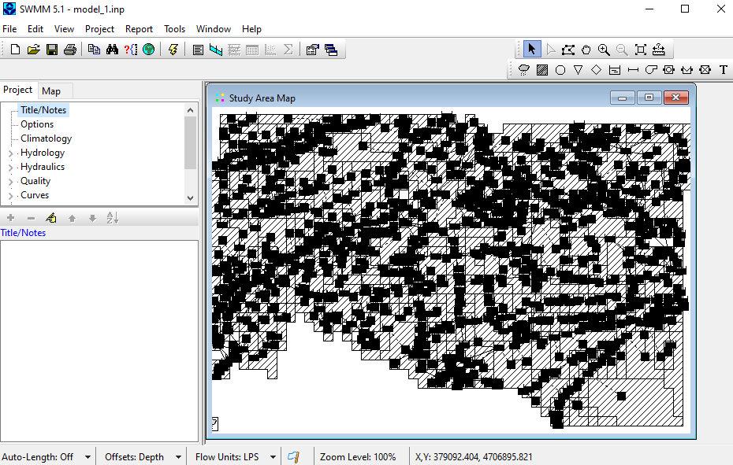

# Quickstart

SWMManywhere is a Python tool to synthesise Urban Drainage Models (UDM) anywhere in the world.
It handles everything from data acquisition to running the UDM in the [SWMM](https://www.epa.gov/sites/default/files/2019-02/documents/epaswmm5_1_manual_master_8-2-15.pdf) software.

## Install SWMManywhere

Install SWMManywhere:

```bash
pip install swmmanywhere
```

## Run SWMManywhere

The intended use of SWMManywhere is via a Command Line Interface (CLI) that receives
the path to a [configuration file](config_guide.md). You can copy the
[minimum viable configuration file](config_guide.md/#minimum-viable-configuration)
and run SWMManywhere with the command below:

```sh

```

which will create a SWMM input file (`.inp`) at the file location:

```text
<base_dir>/<project>/bbox_1/model_1/model_1.inp
```

## Use your model

If you prefer GUIs then the easiest thing now is to download the [SWMM software](https://www.epa.gov/water-research/storm-water-management-model-swmm) and load your model in there.
The example above looks as follows:



From here you can run or edit your model.

If you want to investigate your model in GIS, then the geospatial data that was formatted into the model file (`model_1.inp`) is also available at:

```text
<base_dir>/<project>/bbox_1/model_1/nodes.geojson
<base_dir>/<project>/bbox_1/model_1/edges.geojson
<base_dir>/<project>/bbox_1/model_1/subcatchments.geojson
```

## Not happy with your model?

Then it sounds like you want to explore the wide range of customisability that SWMManywhere offers!
See our [guides](config_guide.md) to understand what is going on in greater detail and how to create better synthetic UDMs.
